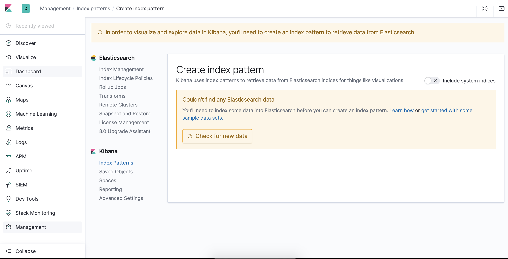

## Install Elasticsearch & Kibana with Docker ##

Elasticsearch and Kibana are also available as Docker images. A list of all published Docker images and tags is available at www.docker.elastic.co.

### 1. Install Elasticsearch ###
**Pull the image**
```bash
docker pull docker.elastic.co/elasticsearch/elasticsearch:7.6.1
```

**Starting the single node with Docker**
```bash
docker run -p 9200:9200 -p 9300:9300 -e "discovery.type=single-node" -d --name elasticsearch docker.elastic.co/elasticsearch/elasticsearch:7.6.1
```

**Stop the container**
```bash
docker stop elasticsearch
```

**Start the container**
```bash
docker start elasticsearch
```

**Testing**
Open browser at: http://localhost:9200/
```json
{
  "name": "000fdda5075c",
  "cluster_name": "docker-cluster",
  "cluster_uuid": "Ve8rhcIpTnKGGjb8oGzD4Q",
  "version": {
    "number": "7.6.1",
    "build_flavor": "default",
    "build_type": "docker",
    "build_hash": "aa751e09be0a5072e8570670309b1f12348f023b",
    "build_date": "2020-02-29T00:15:25.529771Z",
    "build_snapshot": false,
    "lucene_version": "8.4.0",
    "minimum_wire_compatibility_version": "6.8.0",
    "minimum_index_compatibility_version": "6.0.0-beta1"
  },
  "tagline": "You Know, for Search"
}
```

### 2. Install Kibana ###
**Pull the image**
```bash
docker pull docker.elastic.co/kibana/kibana:7.6.1
```

**Running Kibana and connect to Elasticsearch**
```bash
docker run --link elasticsearch:elasticsearch -p 5601:5601 -d --name kibana docker.elastic.co/kibana/kibana:7.6.1
```

**Stop the container**
```bash
docker stop kibana
```

**Start the container**
```bash
docker start kibana
```

**Testing**
Open browser at: http://localhost:5601/
