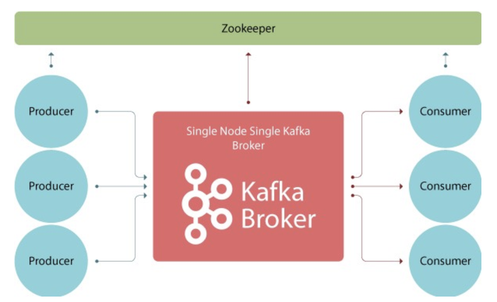

## Install Kafka Zookeeper and Broker with Docker ##

### Apache ZooKeeper ###
Kafka stores information about the cluster and consumers into Zookeeper. 
ZooKeeper acts as a coordinator between them.



### Kafka Broker & Cluster ###
A single Kafka server (process) is called a broker. 
The main responsibilities of a broker are: get messages from producers, store them on disk and respond to consumer's requests.

A Kafka broker can be a part of a Kafka cluster. 
A broker can be a cluster controller or not and also be a leader (owner) of several partitions and keeps a redundant copy of several other partitions (for replication).

### Installing ###
1. Setup a kafka network
```bash
docker network create kafka-net --driver bridge
```

2. Install KafKa Zookeeper
```bash
docker run -p 2181:2181 --network kafka-net -e ALLOW_ANONYMOUS_LOGIN=yes -d --name zookeeper-server bitnami/zookeeper:latest
```
*Set “ALLOW_ANONYMOUS_LOGIN” configuration to true because we want to allow users to connect to ZooKeeper easily (without authentication).
This configuration is not suitable for production use.*

3. Install Kafka Broker
```bash
docker run -p 9092:9092 --network kafka-net -e ALLOW_PLAINTEXT_LISTENER=yes -e KAFKA_CFG_ZOOKEEPER_CONNECT=zookeeper-server:2181 -e KAFKA_CFG_ADVERTISED_LISTENERS=PLAINTEXT://localhost:9092  -d --name kafka-server bitnami/kafka:latest
```

### Testing ###
*Make sure that you installed the kafka client on the local machine.*

1. Let create the first topic
```bash
kafka-topics --create --zookeeper localhost:2181 --replication-factor 1 --partitions 12 --topic first
```

2. Now list all the topics from the zookeeper
```bash
kafka-topics --list --zookeeper localhost:2181
```

3. Start Kafka Zookeeper and Broker
```bash
docker start zookeeper-server 
docker start kafka-server 
```

4. Stop Kafka Broker and Zookeeper
```bash
docker stop kafka-server
docker stop zookeeper-server  
```