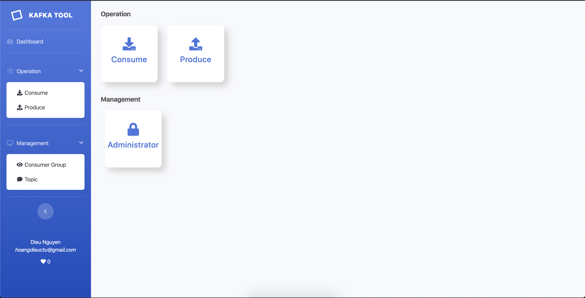
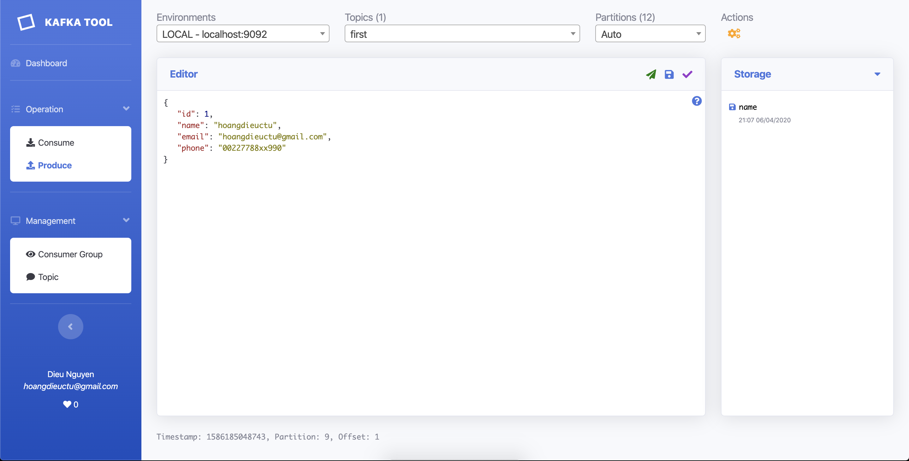
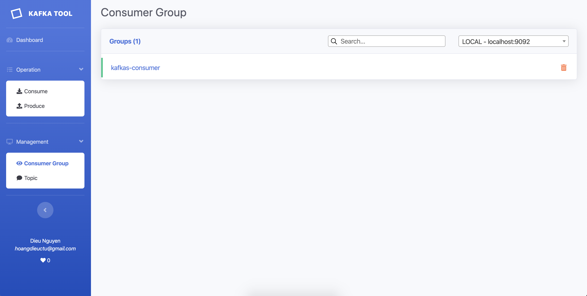
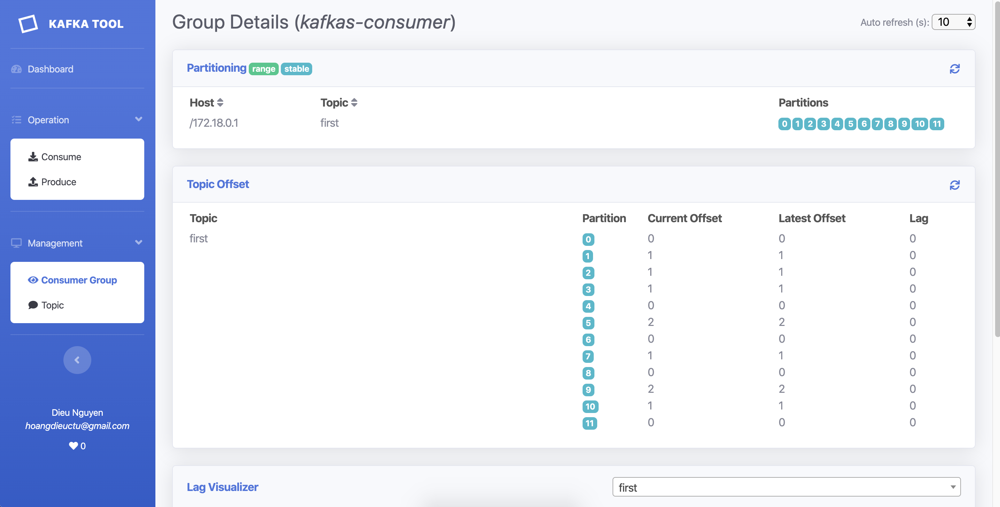
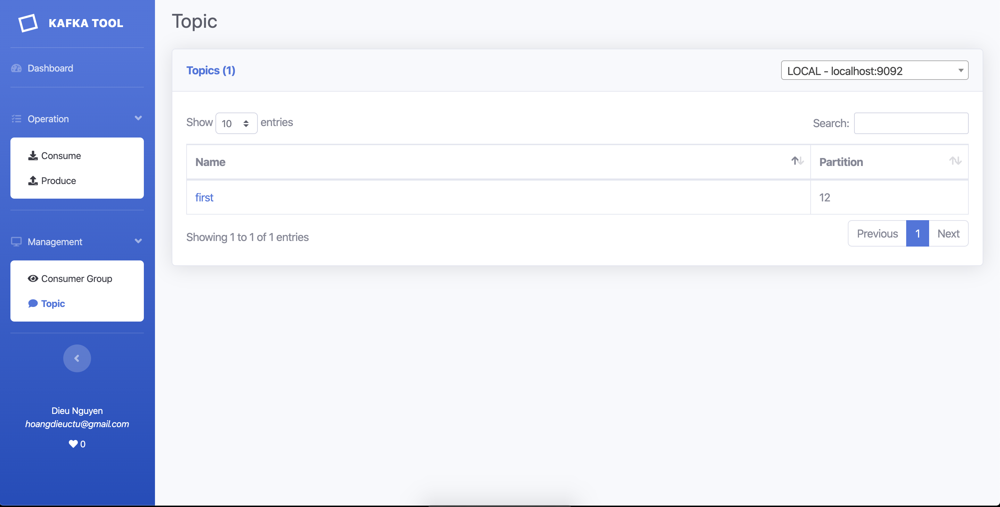
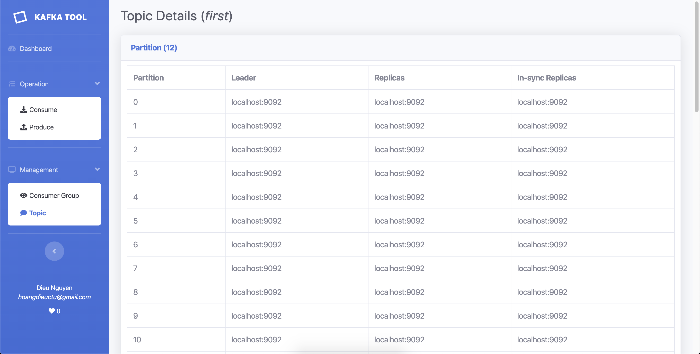
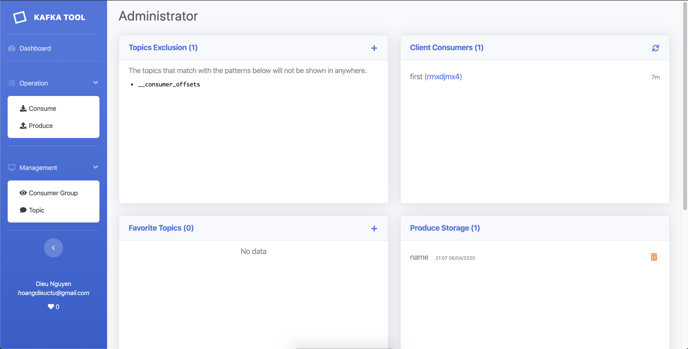

## Kafkas ##
The powerful tool that help to interact with Kafka server.
This include:
1. Consume a topic
2. Produce a message
3. Consumer lag monitor
4. Topic management
5. Admin page

More...

### Build ###
```bash
build.sh
```

### Run ###

Before running, make sure that you installed Kafka zookeeper and broker.
If not, you can refer this: [Install Kafka Zookeeper and Broker with Docker](https://github.com/hoangdieuctu/tools/tree/master/docker/kafka-zookeeper-and-broker)

Default configuration
```bash
java -jar kafkas.war
```

Change kafka server config
```bash
java -Dkafka.envs=LOCAL:127.0.0.1:9092 -jar kafkas.war
```

### Configuration ###

1. kafka.envs: Multiple hosts separate by command. Default is LOCAL:localhost:9092
2. spring.security.user.name: Admin username. Default is 'admin'
3. spring.security.user.password: Admin password. Default is 'Admin@123'.
4. produce.history.items: Total history records. Default is 1024 records.
5. max.kafka.admin.client.connection.pool: Admin connection pool. Default is 20.
6. max.kafka.consumer.lag.connection.pool: Lag connection pool. Default is 10.

### Features ###
1. Index page

2. Consume page

3. Produce page

4. Consumer group page

And we can view the details of the consumer group.

5. Topic page

View details of a topic.

6. Admin page
