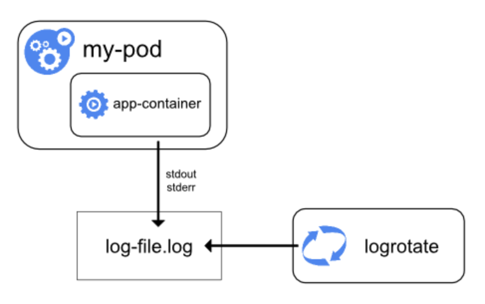
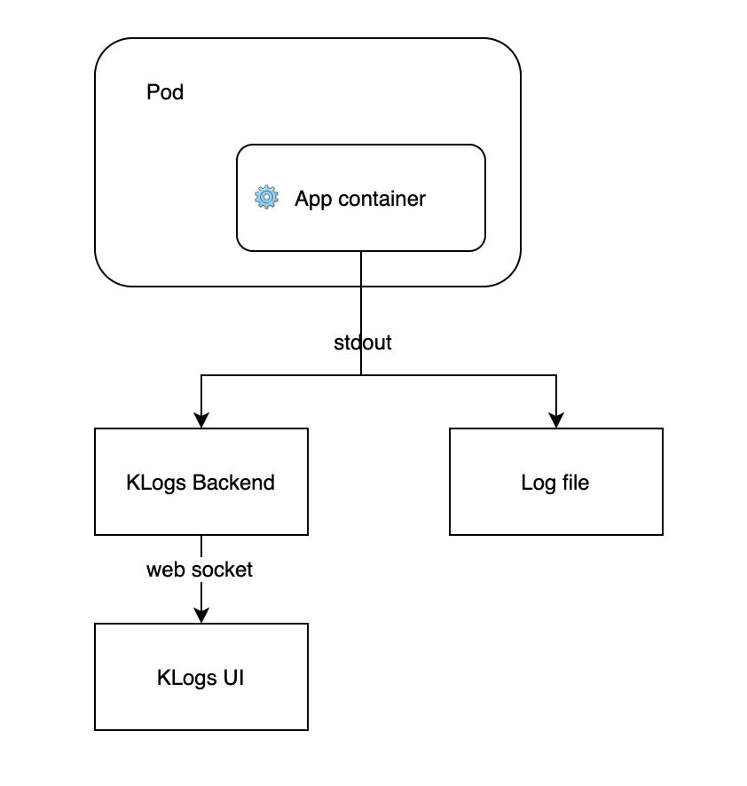

## KLogs ##

We all use **kubectl logs** to help us debug and monitor our applications. 
When a containerized application writes to stdout and stderr, the container engine handles and redirects these streams to a logging driver, which by default in Kubernetes is written to a file in json format.

KLogs is using the websocket technology, it attach a stream to stdout of a kubernetes pod and forward the output to the UI.

